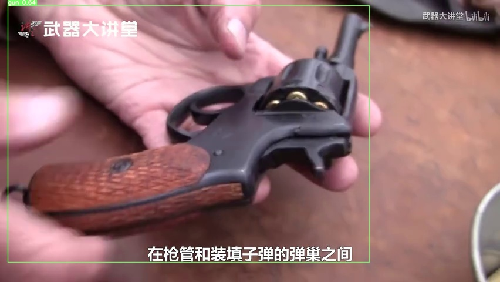
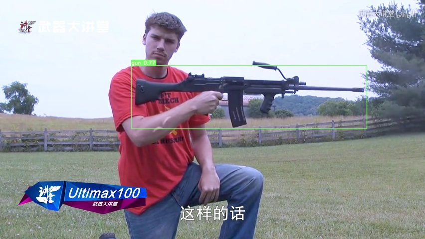

# IronSight-Alert
## Detects guns in images utilizing Convolutional Neural Networks via the YoloV7 Model. Alerts can be enabled. This works on both images and videos with a goal of being used in security camera feeds to warn of gunmen.

### Disclaimer: I didn't make the dataset this AI was trained on; all credit goes to the orignial authors.

# Dataset Citation:  
### Authors: Delong Qi, Weijun Tan, Zhifu Liu, Qi Yao, and Jingfeng Liu  
### Title: "A Dataset and System for Real-Time Gun Detection in Surveillance Video Using Deep Learning”  
### Journal: https://arxiv.org/abs/2105.01058 (arXiv.2105.01058)  
### Year: 2020  

# Examples:

## Here are some random images of guns. You can see IronSight Alert has boxed them off and labeled each detected gun.

# Alerts

## SMS Alerts can be enabled by providing the parameter --send_alert True. Once the alert server is setup and Twilio account information is provided in the [.env](alerts/.env) file, alerts can be sent.

## Example Alerts: 

